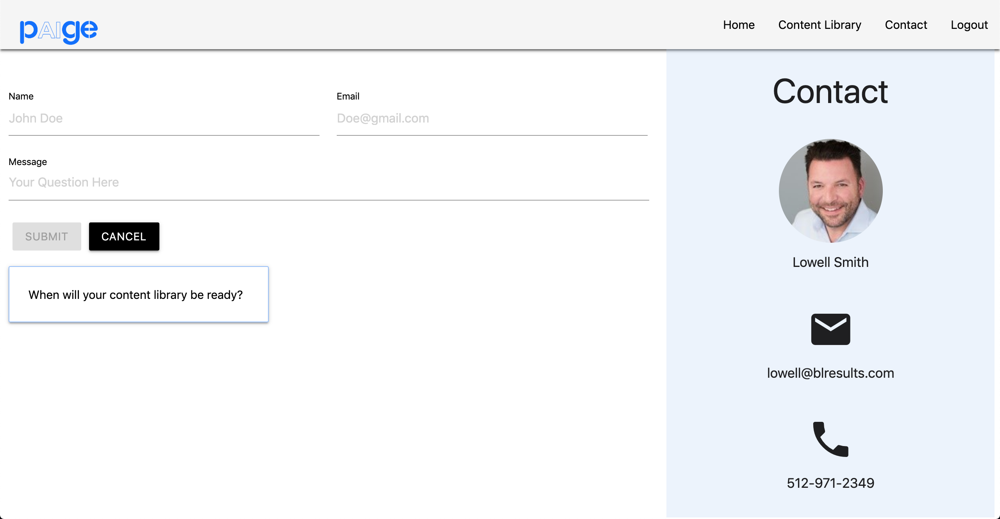

# PAIge App
## Description
#### PAIge is an upcoming website that will offer clients business training through multiple micro-courses in topics such as Sales, Marketing, HR, Customer Support, and Operations. The problems with other similar websites are that their courses are lengthy and the rention rate is low at about 30%. PAIge looks to combat these problems by keeping courses under 5 minutes by removing filler content and providing quizzes and surveys following the course to increase the viewers rentention of the material.

## Getting Started
#### Website Link - https://paigecourse.herokuapp.com/
#### 1) User can login using the navigation bar
#### 2) The content library page will hold some of the materials taught
#### 3) The contact page has information on how to contact about questions and also can send in question that will be answered

## App Contact Page

## Technologies Used
#### - Mongoose
#### - MongoDB
#### - Express
#### - React
#### - NodeJs

## Future Goals
#### - Create an Admin user
#### - Allow Admin user respond to questions
#### - Fill libray with content once ready

